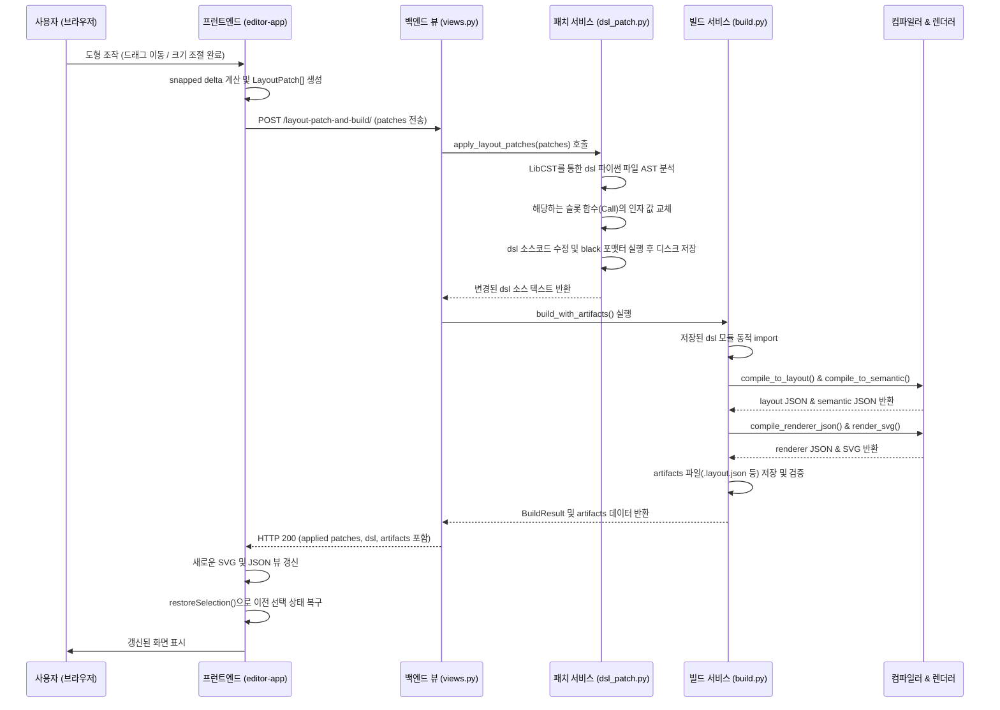

# SOLID_EDITOR_EXISTING_AUDIT

본 문서는 `modu_math` 기존 웹 에디터의 전체 구조, API 계약, 상태 관리 및 세부 동작에 대한 조사 결과입니다.

## 1. 파일 지도 (File Map)

### 1.1 프런트엔드 관련 파일
* **템플릿**:
  * [index.html](file:///c:/projects/modu_math/src/modu_math_web/editor/templates/editor/index.html): 기존 에디터의 메인 HTML 진입점. 레이아웃 분할 패널(문제 트리, 캔버스 뷰포트, 속성 인스펙터, JSON 탭 뷰, DSL 에디터 등)과 로딩/에러 표시 마운트 엘리먼트를 포함합니다.
* **스타일시트**:
  * [editor.css](file:///c:/projects/modu_math/src/modu_math_web/editor/static/editor/css/editor.css): 에디터 전반의 UI 스타일, 그리드/플렉스 배치, 캔버스 스케일링 테두리, 선택/호버 효과, 리사이즈 핸들 스타일링 정의.
* **스크립트**:
  * [editor-api.js](file:///c:/projects/modu_math/src/modu_math_web/editor/static/editor/js/editor-api.js): Django 백엔드와 통신하는 API 요청 헬퍼. CSRF 토큰 처리 및 API 오류 유형화(`ERROR_TYPES`) 포함.
  * [editor-state.js](file:///c:/projects/modu_math/src/modu_math_web/editor/static/editor/js/editor-state.js): Pub/Sub 방식의 전역 상태 관리 모듈. `getState`, `setState`, `subscribe`, `resetState`를 통해 캔버스 뷰와 동기화.
  * [editor-commands.js](file:///c:/projects/modu_math/src/modu_math_web/editor/static/editor/js/editor-commands.js): Undo/Redo 기능을 제공하기 위한 로컬 커맨드 스택 관리 모듈.
  * [editor-properties.js](file:///c:/projects/modu_math/src/modu_math_web/editor/static/editor/js/editor-properties.js): 속성 인스펙터 입력 폼 이벤트 바인딩 보조 유틸리티.
  * [editor-canvas.js](file:///c:/projects/modu_math/src/modu_math_web/editor/static/editor/js/editor-canvas.js): SVG 좌표 변환, Marquee Box 드래그 계산, Hit Proxy 추가, 선택 영역 Overlay 및 8방향 리사이즈 핸들, 선의 회전/이동 등 기하 좌표 조작 처리.
  * [editor-app.js](file:///c:/projects/modu_math/src/modu_math_web/editor/static/editor/js/editor-app.js): 메인 컨트롤러. 마우스 드래그/리사이즈 이벤트 바인딩, 키보드 단축키, 정렬/레이어 명령 적용, 백엔드 연동 흐름 제어, 60개 이상의 도형 정의(`SHAPE_CATEGORIES`) 등을 처리하는 거대한 스크립트.

### 1.2 Django 백엔드 관련 파일
* **라우팅 및 뷰**:
  * [urls.py](file:///c:/projects/modu_math/src/modu_math_web/urls.py): `/editor/` 경로를 기존 에디터 뷰로, `/editor-next/` 경로를 새 에디터 뷰로 연결.
  * [editor/urls.py](file:///c:/projects/modu_math/src/modu_math_web/editor/urls.py): `/api/editor/problems/` 등 기존 에디터용 REST API 라우팅.
  * [views.py](file:///c:/projects/modu_math/src/modu_math_web/editor/views.py): API 엔드포인트 뷰 함수들. 입출력 검증, 예외 처리, 응답 JSON 래핑 수행.
* **비즈니스 서비스**:
  * [problems.py](file:///c:/projects/modu_math/src/modu_math_web/editor/services/problems.py): 문제 디렉토리 목록 조회, 상세 JSON 생성, DSL 원본 읽기/쓰기 및 자산 조회 서비스.
  * [build.py](file:///c:/projects/modu_math/src/modu_math_web/editor/services/build.py): DSL을 로드하여 `semantic.json`, `layout.json`, `renderer.json`, `svg` 파일을 빌드 및 스키마 검증하는 컴파일 파이프라인.
  * [dsl_patch.py](file:///c:/projects/modu_math/src/modu_math_web/editor/services/dsl_patch.py): **가장 핵심적이고 민감한 파일**. LibCST를 활용해 파이썬 DSL 코드를 AST 레벨에서 파싱하고, 슬롯의 좌표/크기/속성 수정 또는 추가/삭제를 Patch 방식으로 원본을 훼손하지 않고 반영하는 로직.

---

## 2. 기능 인벤토리 (Feature Inventory)

| ID | 기능 | 기존 구현 위치 | 입력 이벤트 | 상태 변경 | 서버 호출 | 결과 |
| :--- | :--- | :--- | :--- | :--- | :--- | :--- |
| F001 | 문제 목록 로딩 | `editor-app.js` (`loadProblems`) | 화면 진입 | `loading = true`, `problems` 갱신 | `GET /api/editor/problems/` | 왼쪽 패널에 폴더/문제 목록 트리 렌더링 |
| F002 | 단일 선택 | `editor-canvas.js`, `editor-app.js` | click, pointerdown | `selectedIds` 갱신, inspector 포커싱 | 없음 | 슬롯 외곽에 파란 선택 테두리 및 8방향 리사이즈 핸들 표시 |
| F003 | 다중 선택 | `editor-canvas.js` (`beginMarqueeBox`, `finishMarqueeBox`) | Shift+클릭 또는 캔버스 빈 공간 마우스 드래그 | `selectedIds` 추가 갱신 | 없음 | 드래그 영역 내부 슬롯 일괄 선택, bounding box 통합 테두리 표시 |
| F004 | 드래그 이동 | `editor-app.js` (`onPointerMove`), `editor-canvas.js` | pointerdown -> pointermove -> pointerup | `dirty = true` 임시 상태, local SVG 속성 실시간 수정 | `POST /api/editor/problems/{id}/layout-patch-and-build/` | pointerup 시 스냅(5px) 적용된 최종 좌표로 서버 패치 적용 및 빌드 갱신 |
| F005 | 8방향 리사이즈 | `editor-canvas.js` (`adjustedBBox`), `editor-app.js` | 핸들 pointerdown -> move -> up | `dirty = true` 임시 상태, local SVG 크기 실시간 수정 | `POST .../layout-patch-and-build/` | pointerup 시 크기/좌표 정보가 반영된 최종 패치를 서버에 전송 및 빌드 갱신 |
| F006 | 도형 갤러리 삽입 | `editor-app.js` (`insertSelectedShape`) | 갤러리 아이콘 click 후 캔버스 click | 신규 슬롯 임시 드로잉 상태 | `POST .../layout-patch-and-build/` | 선택한 도형(rect, circle, polygon, path 등)을 absolute diagram 영역에 add 패치 및 재생성 |
| F007 | 슬롯 삭제 | `editor-app.js` (`deleteSelectedSlots`) | Delete / Backspace 키 또는 toolbar 삭제 클릭 | `selectedIds = []` | `POST .../layout-patch-and-build/` | 선택된 슬롯들의 delete 패치 전송, 빌드 결과 반영 후 UI 클리어 |
| F008 | 속성 편집 | `editor-properties.js`, `editor-app.js` | input change, Enter keydown, blur | 로컬 속성값 선반영 | `POST .../layout-patch-and-build/` | 입력된 속성값(fill, stroke, font_size 등)에 대해 update 패치 전송 및 빌드 갱신 |
| F009 | 인라인 텍스트 편집 | `editor-app.js` (`beginInlineTextEdit`) | text 슬롯 더블클릭 | `inlineEditor` 활성화, text input 오버레이 | `POST .../layout-patch-and-build/` | 텍스트 박스에 값을 입력하고 Enter/Blur 시 update 패치 전송 및 갱신 |
| F010 | 정렬 도구 | `editor-app.js` (`alignSelected`) | 정렬 버튼 click | 각 슬롯별 최종 좌표 정렬 계산 | `POST .../layout-patch-and-build/` | 다중 선택된 슬롯들을 Left/Center/Right/Top/Middle/Bottom 기준으로 일괄 patch 전송 |
| F011 | 레이어 순서 조절 | `editor-app.js` (`layerSelected`) | 레이어 버튼 click | region의 slot_ids 배열 순서 변경 | `POST .../layout-patch-and-build/` | region의 slot_ids 재정렬 패치 전송 및 빌드 |
| F012 | Undo / Redo | `editor-commands.js`, `editor-app.js` | Ctrl+Z / Ctrl+Y 단축키 또는 toolbar 클릭 | `undoStack`, `redoStack` 로컬 스택 갱신 | `POST .../layout-patch-and-build/` | 스택에서 이전/이후 상태를 꺼내어 패치 재전송 및 화면 빌드 동기화 |
| F013 | DSL 포맷 | `editor-app.js` (`formatDsl`) | Format 버튼 click | `formatting = true`, `dsl` 코드 갱신 | `POST /api/editor/problems/{id}/dsl/format/` | 디스크 DSL 코드 포맷터(black) 적용 및 결과 갱신 |
| F014 | 문제 빌드 | `editor-app.js` (`buildProblem`) | Build 버튼 click | `building = true`, artifacts 갱신 | `POST /api/editor/problems/{id}/build/` | 전체 DSL 재생성 및 컴파일 실행, 새로운 SVG와 JSON 아티팩트 목록 갱신 |
| F015 | Zoom 및 Pan | `editor-canvas.js`, `editor-app.js` | wheel, Alt+드래그, middle click, 툴바 버튼 | `zoom`, `pan` 배율 및 오프셋 좌표 갱신 | 없음 | 캔버스 컨테이너 SVG 스타일 `transform` 값 실시간 갱신 |

---

## 3. 단축키 인벤토리 (Keyboard Shortcuts)

| 단축키 | 조건 | 동작 | 기존 구현 위치 |
| :--- | :--- | :--- | :--- |
| `Ctrl+Z` / `Cmd+Z` | 포커스가 input/textarea가 아닐 때 | 실행했던 마지막 동작 취소 (Undo) | `editor-app.js` (line 6241) |
| `Ctrl+Y` / `Cmd+Y` | 포커스가 input/textarea가 아닐 때 | 취소했던 마지막 동작 재실행 (Redo) | `editor-app.js` (line 6246) |
| `Ctrl+Shift+Z` | 포커스가 input/textarea가 아닐 때 | 취소했던 마지막 동작 재실행 (Redo) | `editor-app.js` (line 6246) |
| `Ctrl+C` / `Cmd+C` | 포커스가 input/textarea가 아닐 때 | 선택한 슬롯들의 정보를 클립보드 버퍼에 복사 | `editor-app.js` (line 6251) |
| `Ctrl+V` / `Cmd+V` | 포커스가 input/textarea가 아닐 때 | 복사된 슬롯들을 캔버스 중심 근처에 붙여넣기 (Paste) | `editor-app.js` (line 6257) |
| `Escape` | 그리기 모드 또는 shape selection 중 | 드로잉 취소 / shape format menu 및 gallery 닫기 | `editor-app.js` (line 6262) |
| `Delete` / `Backspace` | 선택된 슬롯이 있을 때 | 선택된 모든 슬롯 삭제 | `editor-app.js` (line 6276) |
| `ArrowLeft` / `ArrowRight` | 선택된 슬롯이 있을 때 | 선택된 슬롯들을 수평 방향으로 1px 이동 (Shift 조합 시 10px 이동) | `editor-app.js` (line 6285) |
| `ArrowUp` / `ArrowDown` | 선택된 슬롯이 있을 때 | 선택된 슬롯들을 수직 방향으로 1px 이동 (Shift 조합 시 10px 이동) | `editor-app.js` (line 6287) |

---

## 4. API 인벤토리 (API Endpoints)

| Method | URL | 요청 | 응답 | 오류 | 호출 위치 |
| :--- | :--- | :--- | :--- | :--- | :--- |
| `GET` | `/api/editor/problems/` | 없음 | `{"problems": [...]}` | 500 (Server Error) | `editor-api.js` (`listProblems`) |
| `GET` | `/api/editor/problems/{id}/` | 없음 | `{"problem_id": "...", "dsl": "...", "semantic": {...}, "layout": {...}, "renderer": {...}, "svg": "..."}` | 404 (Not Found), 500 | `editor-api.js` (`loadProblem`) |
| `POST` | `/api/editor/problems/{id}/dsl/` | `{"dsl": "코드문자열"}` | `{"ok": true, "problem_id": "...", "dsl": "포맷팅된코드"}` | 400 (Bad Request), 500 | `editor-api.js` (`saveDsl`) |
| `POST` | `/api/editor/problems/{id}/dsl/format/` | 없음 | `{"ok": true, "problem_id": "...", "dsl": "포맷팅된코드"}` | 400, 404, 500 | `editor-api.js` (`formatDsl`) |
| `POST` | `/api/editor/problems/{id}/build/` | 없음 | `{"ok": true, "problem_id": "...", "stdout": "...", "stderr": "...", "artifacts": {...}}` | 500 (Build Failure) | `editor-api.js` (`buildProblem`) |
| `POST` | `/api/editor/problems/{id}/layout-patch/` | `{"patches": [...], "format": true}` | `{"ok": true, "problem_id": "...", "applied": [...], "dsl": "..."}` | 400 (Patch Failure), 500 | `editor-api.js` (`applyLayoutPatches`) |
| `POST` | `/api/editor/problems/{id}/layout-patch-and-build/` | `{"patches": [...], "format": true}` | `{"ok": true, "problem_id": "...", "applied": [...], "dsl": "...", "build": {...}, "artifacts": {...}}` | 500 (Build/Patch Failure) | `editor-api.js` (`applyLayoutPatchesAndBuild`) |
| `GET` | `/api/editor/assets/{id}/{filename}` | 없음 | File Stream (Mime Type 자동 판별) | 400, 404, 500 | `problems.py` (`_rewrite_svg_asset_hrefs`에 의해 SVG 내부 이미지 주소로 주입됨) |

---

## 5. 상태 인벤토리 (State Inventory)

기존 `editor-state.js` 및 `editor-app.js`에서 유지하는 전역 및 세션 상태 구조는 다음과 같습니다.

* **선택 상태**: `selectedIds` (string[]), `selectedSlots` (Map<id, element>), `selectedElement` (DOM Element)
* **도구 상태**: `activeTool` ("select" | "pan")
* **선택 모드**: `pickMode` ("all" | "linepath" | "text" | "shape")
* **뷰포트 상태**: `zoom` (number, 기본 1.0), `pan` (Point {x, y})
* **히스토리 상태**: `undoStack` (Command[]), `redoStack` (Command[])
* **트랜잭션 상태**: `pendingPatches` (LayoutPatch[]), `dirty` (boolean), `saving` (boolean), `loading` (boolean), `building` (boolean)
* **아티팩트 데이터**: `problemId` (string | null), `dsl` (string), `artifacts` (Layout/Renderer/Solvable/Semantic JSON 및 SVG 문자열을 담은 객체)
* **기타 보조 상태**: `snapEnabled` (boolean, 스냅 활성화 여부), `inlineTextEditState` ({el, slotId, originalText} | null)

---

## 6. 저장·빌드 시퀀스 (Save & Build Sequence)

기존 에디터의 저장 및 빌드는 UI 조작 단계에서 발생한 변경 정보(`LayoutPatch`)를 즉시 전달받아 LibCST AST 패치 및 컴파일러를 연동하는 흐름입니다.

---

## 7. 발견한 숨은 기능 및 특이 사항 (Hidden Features)

1. **Hit Proxy 보조 도구 (`appendStrokeHitProxy`, `appendTextHitProxy`)**:
   * SVG에서 `line` 이나 `path`는 굵기가 얇으면 클릭하기가 극도로 어렵습니다. 이를 보완하기 위해 기존 에디터는 SVG 로드 직후 `stroke-width`가 18px에 달하고 `stroke-opacity`가 `0.001`인 투명한 SVG 프록시 요소를 원래 요소 바로 뒤에 덧붙여 상호작용 영역을 확장시킵니다.
   * `text` 요소의 경우 기하학적인 Bounds 박스를 구한 뒤 투명한 `rect` 요소를 hit proxy로 얹어, 빈 텍스트 슬롯이나 클릭하기 까다로운 텍스트 영역의 드래그 및 정밀 선택을 돕습니다.
2. **키보드 이동 디바운싱 (`queueKeyboardCommit`)**:
   * 방향키(`ArrowLeft`, `ArrowRight` 등)를 꾹 누르고 있으면 수십 번의 `keydown` 이벤트가 발생합니다. 매 이벤트마다 서버 API 요청을 날리면 극심한 딜레이와 충돌이 발생하므로, 기존 구현은 `120ms` 타이머를 두어 키 입력이 멈출 때까지 로컬 엘리먼트 속성만 조작한 뒤 최종 상태를 1회만 커밋합니다.
3. **빌드 완료 후 선택 상태 유지 (`restoreSelection`)**:
   * 서버에서 빌드되어 새로 내려온 SVG 문자열이 캔버스 컨테이너를 덮어쓰기 때문에, DOM 상의 SVG 엘리먼트들이 모두 삭제되고 새로 생성됩니다. 기존 구현은 빌드 직전 선택되었던 슬롯 ID 목록(`selectedIds`)을 메모리에 보관했다가, 새로운 SVG가 렌더링된 후 해당하는 ID를 가진 새 SVG 엘리먼트를 찾아서 다시 클래스(`slot-selected`)를 활성화하고 인스펙터 상태를 유지시킵니다.
4. **동시 수정 충돌 방지 (`flushPendingPatchSaves`)**:
   * 드래그 중이거나 저장 연산이 진행 중인 와중에 수동으로 저장을 클릭하거나 다른 동작을 수행하면 패치 적용 순서가 꼬일 수 있습니다. 기존 에디터는 `pendingPatchSaves` 프로미스 배열을 관리하여 이전 비동기 패치 전송이 완전히 해결될 때까지 `await Promise.allSettled`로 대기하는 안전 장치를 둡니다.
5. **텍스트 인라인 편집 한글 IME 이슈 및 단축키 취소**:
   * 텍스트를 더블클릭하면 캔버스 위 해당 텍스트의 크기/글꼴/위치와 정확히 겹치는 절대 좌표 영역에 `<input>` 엘리먼트를 생성해 올립니다. 이 입력 폼에서 `Escape`를 누르면 이식 전 텍스트로 되돌리고(`originalText`), `Enter`나 `Blur` 시 수정을 확정하여 `commitPatches`를 전송합니다.
